# EPROJECT-PHASE-1

## Download source code
git clone https://github.com/lqkhanhh/22689261_LeQuocKhanh_EProject-Phase-main.git
## 1. Hệ thống giải quyết vấn đề: 
→ Hệ thống mô phỏng quy trình bán hàng trực tuyến, cho phép người dùng đăng ký, đăng nhập, quản lý sản phẩm và đặt hàng.
- Mục tiêu là:
- Tách biệt chức năng từng phần (xác thực, sản phẩm, đơn hàng...).
- Dễ dàng mở rộng, bảo trì và triển khai độc lập.
- Tăng khả năng chịu tải và giao tiếp bất đồng bộ qua RabbitMQ.
## 2. Hệ thống có các dịch vụ:
- Có 4 dịch vụ chính: auth, product, order, gồm 4 dịch vụ chính(auth, product, order, api-gateway) và 2 dịch vụ hạ tầng (MongoDB, RabbitMQ).

## 3. Ý nghĩa từng dịch vụ:
- auth: xử lý đăng ký, đăng nhập, xác thực token (JWT).
- product: quản lý thông tin sản phẩm, CRUD sản phẩm.
- order: xử lý đặt hàng, nhận dữ liệu từ product qua RabbitMQ để tách biệt giao tiếp và tránh phụ thuộc trực tiếp.
- api-gateway: làm cổng trung gian, định tuyến request từ client đến đúng service.
- RabbitQM: Gửi và nhận thông điệp giữa các service theo cơ chế bất đồng bộ (event-driven).
- MongoDB: Lưu trữ dữ liệu cho từng service riêng biệt (AuthDB, ProductDB, OrderDB).

## 4. Mẫu thiết kế được sử dụng:
- Microservices Architecture
- API Gateway
- Message Broker (RabbitMQ)
- Repository 
- JWT Authentication 

### 5. Các dịch vụ giao tiếp với nhau như thế nào:
- Client -> Api gateway (nhận request từ client và điều hướng đến các service) -> service(auth, product, order) 
- service(product) <-> service(order) (Giao tiếp bất đồng bộ qua RabbitMQ)
- service -> database (Mỗi service có MongoDB riêng để lưu dữ liệu của nó, giúp độc lập và tách biệt database)

### 6. Test all business logic with POSTMAN
## Kết quả chạy docker
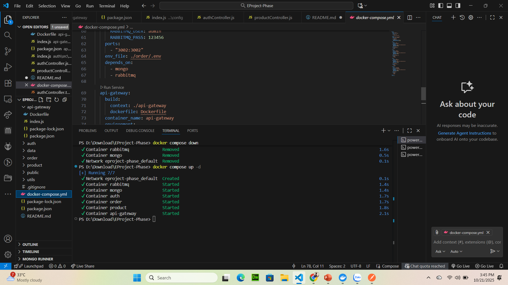
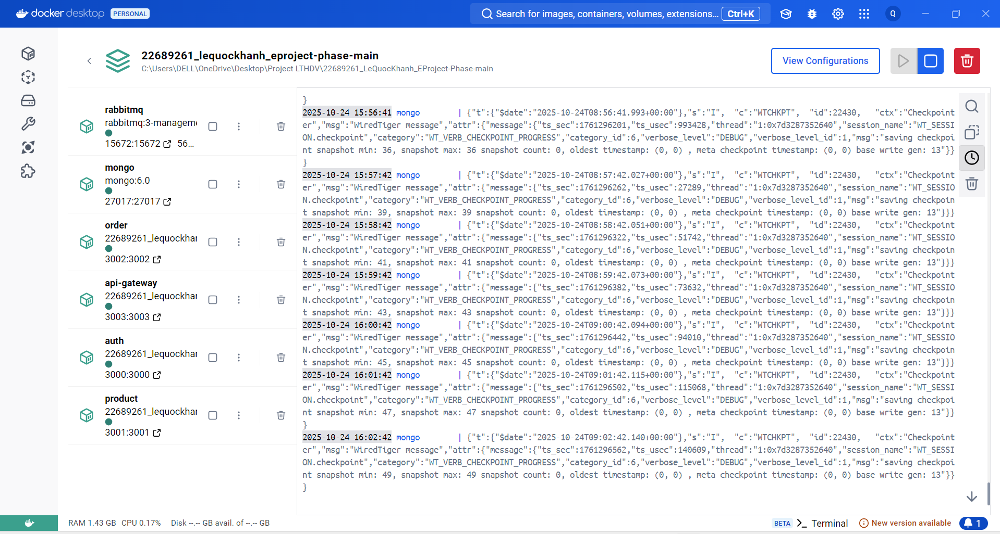
---------------
### Kết quả test postman với register
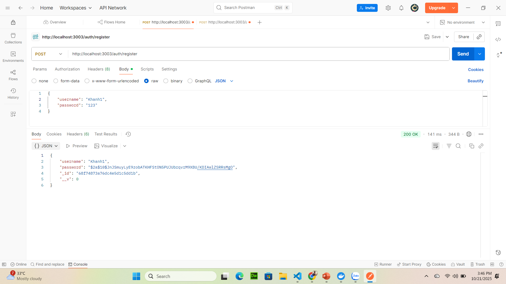
---------------
### Kết quả test postman với login
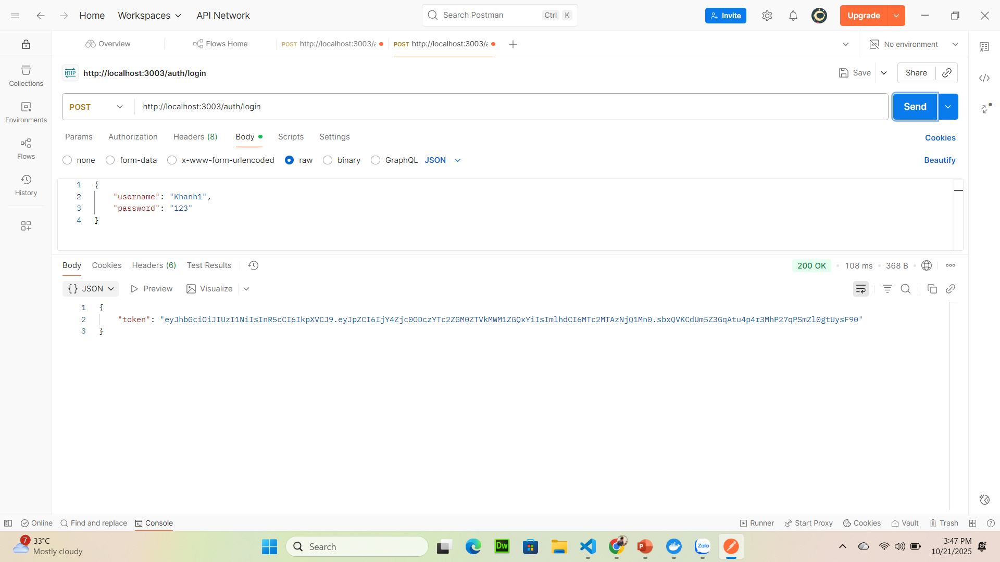
---------------
### Kết quả test postman với tạo product
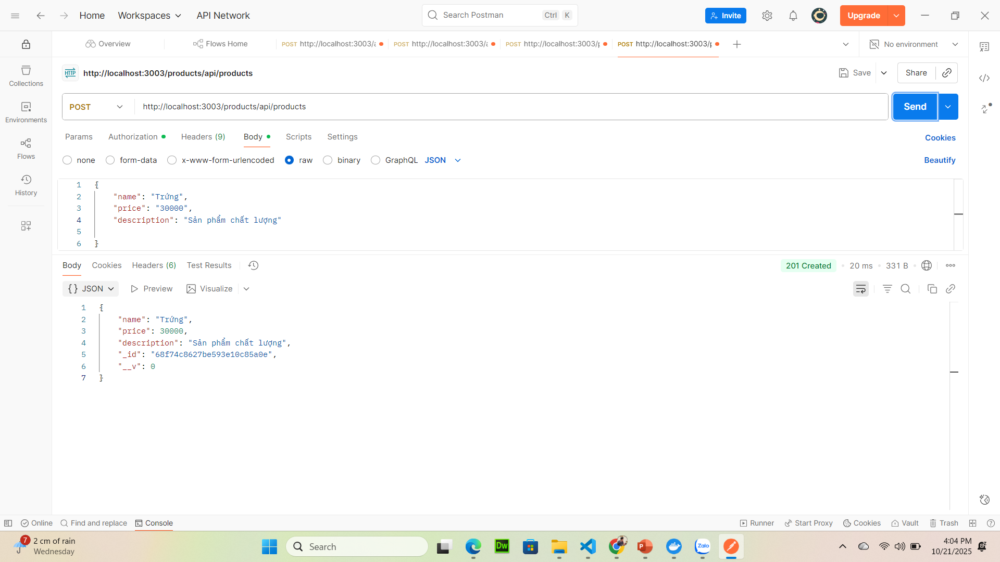
---------------
### Kết quả test postman với order product
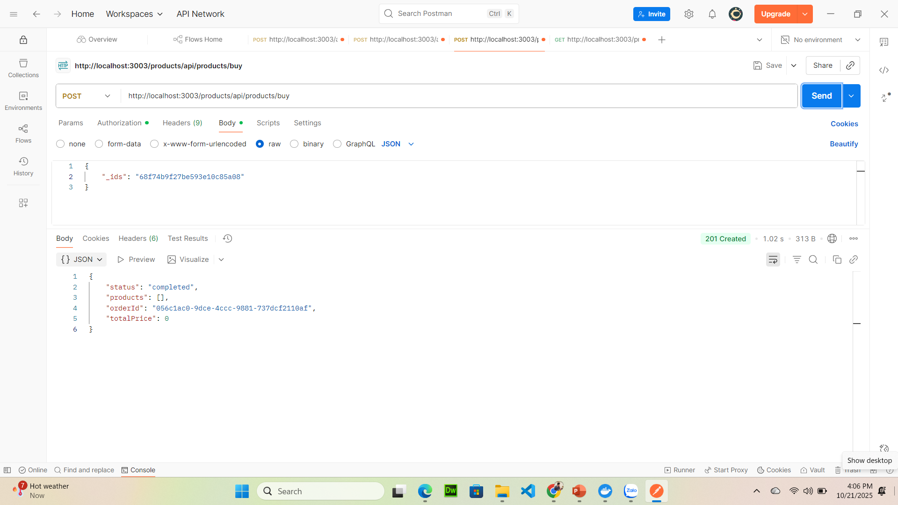
---------------
### Kết quả test postman với xem product
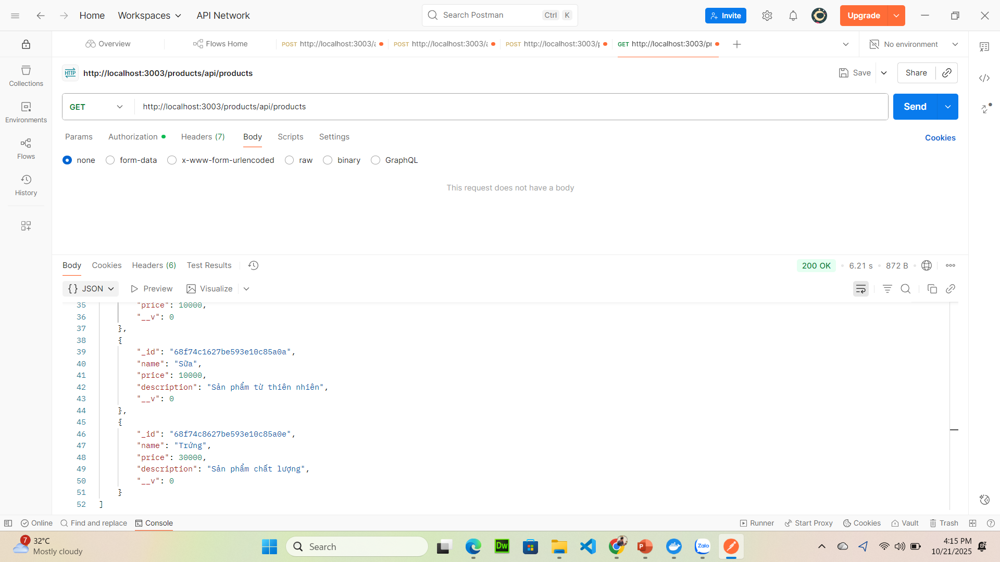
---------------
### Kết quả test postman với rabbit
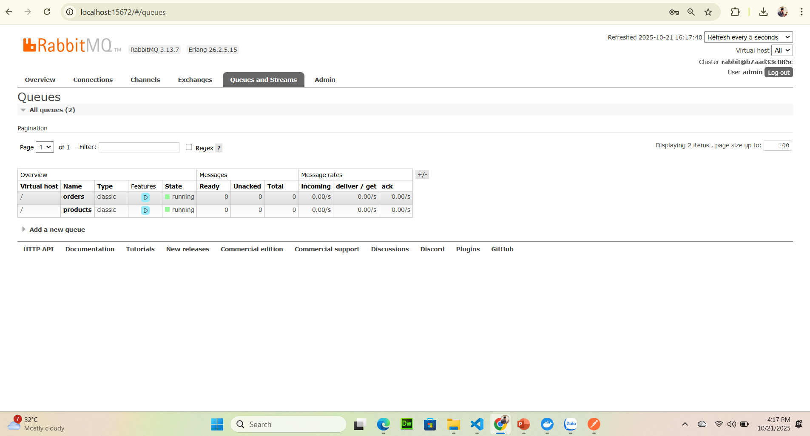
---------------
### Kết quả test postman với lấy thông tin product theo id
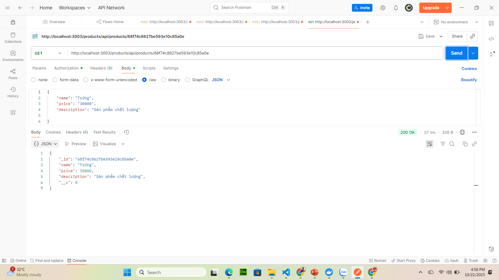

### 7 Kết quả chạy được trên docker
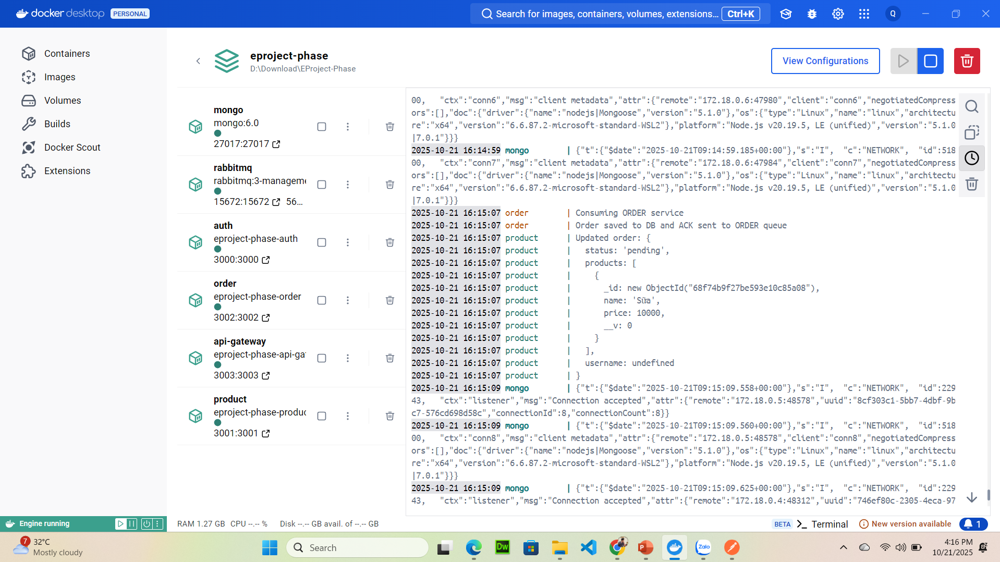

### 8. Github Action: Thực hiện CI/CD với dự án + CI/CD liên kết với Docker

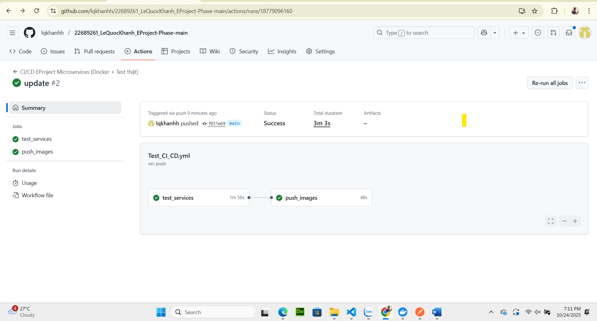

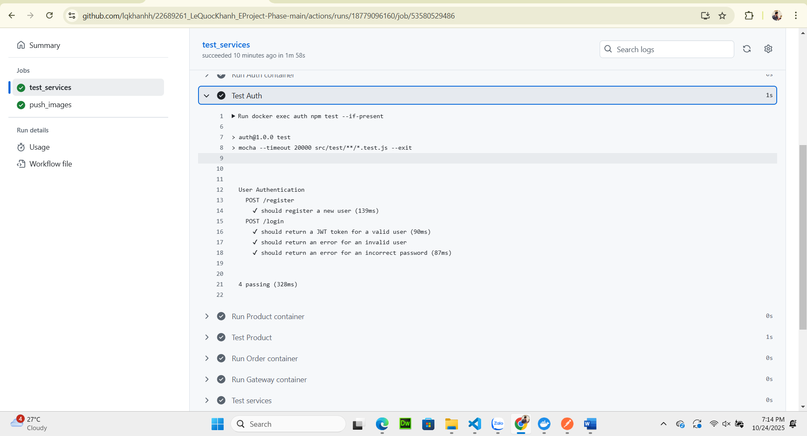

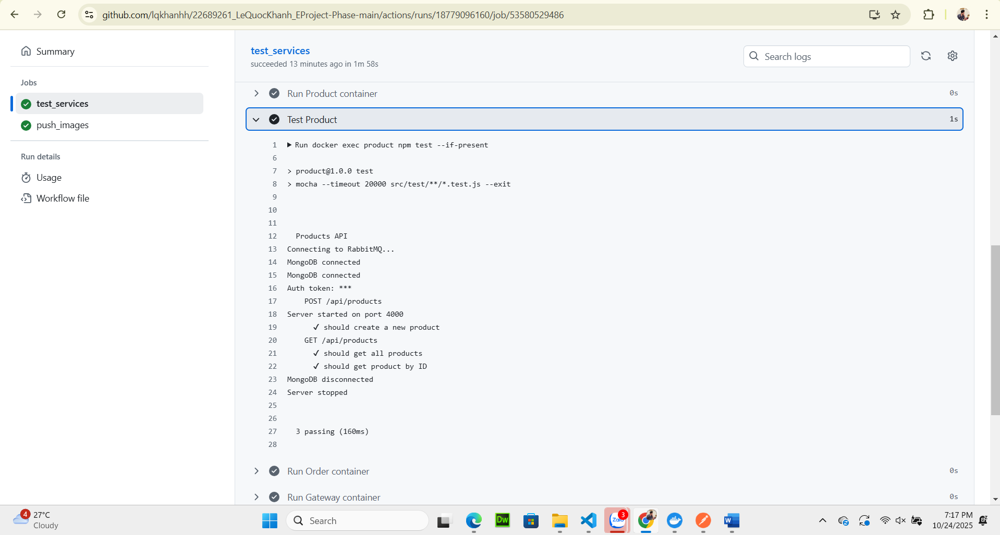

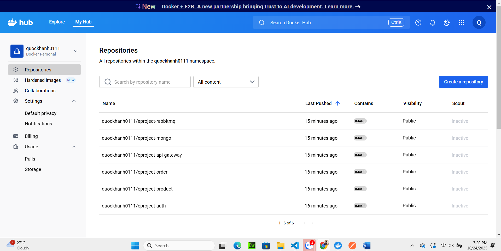

